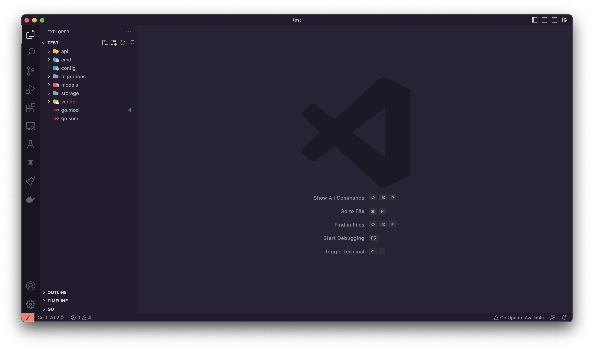
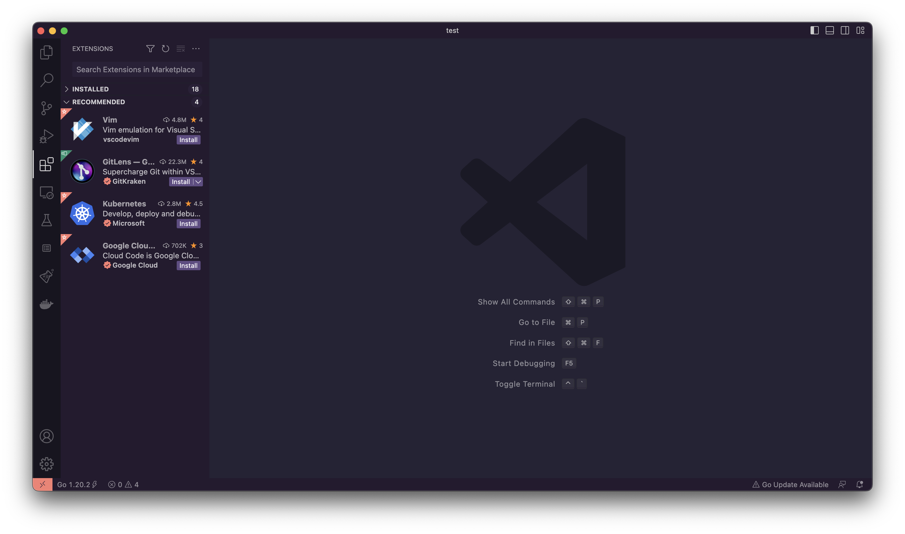
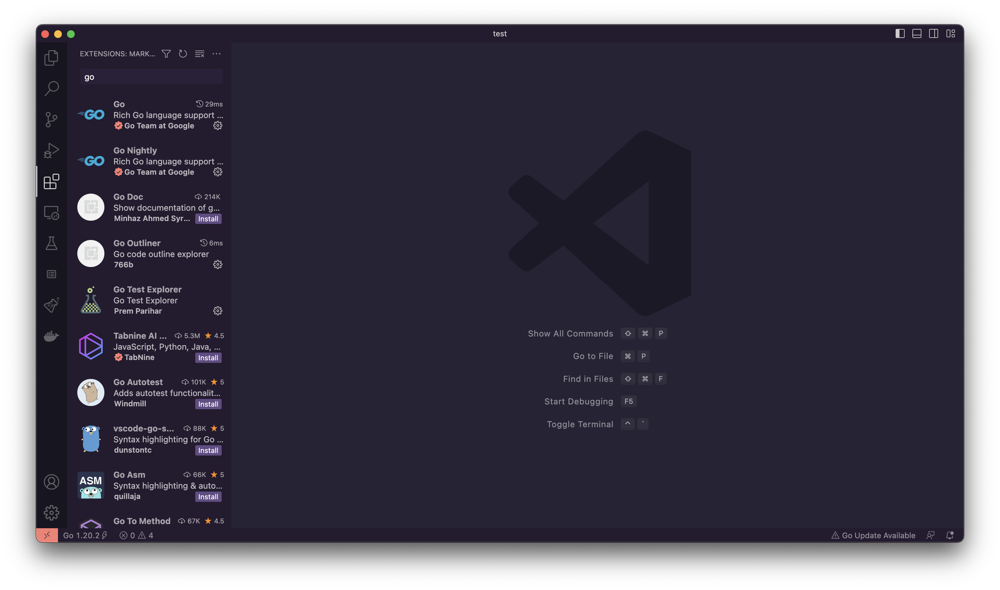

Golang tilini kompyuterimizga o'rnatganimizdan so'ng bizlarga editor yoki IDE  kerak bo'ladi quyidagilardan
o'zingizga yoqqanini tanlab ishlating.

## Vim
Yangi boshlovchilar til sintaksisiga ko'nikish uchun juda ham yaxshi editor hisoblanadi hech qanday  auto compilesiz editor.
Vim haqida tushuncha va vimda ishlash uchun bilimni  [Vim Basics in 8 Minutes](https://www.youtube.com/watch?v=ggSyF1SVFr4&pp=ygURdmltIGZvciBiZWdpbm5lcnM%3D)
videosidan o'rganishingiz mumkin

## Visual Studio

VsCode editorini quyidagi [link](https://code.visualstudio.com/Download) orqali saytga o'tib o'zimizning kompyuter OSiga
mos holatta yuklab olamiz va o'rnatamiz. O'rnatganimizdan so'ng kirib

Asosiy Bardan [Extetions]() bo'limiga o'tamiz

Qidiruvga go deb yozamiz va ba'zi extentionlarni o'rnatib olamiz

[Go](), [Go Nightly]()

## Goland

Ushbu IDE Jetbrains mahsuloti bolib productiv bo'lish uchun yaratilgan juda ko'plab imkoniyatlarga ega [Pullik]() IDE.
30 kunlik test uchun beriladigan imkoniyat orqali ishlatish mumkin IDE ni quyidagi [link](https://www.jetbrains.com/go/download/download-thanks.html) orqali yuklab olishingiz mumkin.
Golang IDE bo'lganligi uchun ko'p narsani o'zi bajaradi masalan PATH larni ham o'zi konfiguratsiya qilib beradi.

